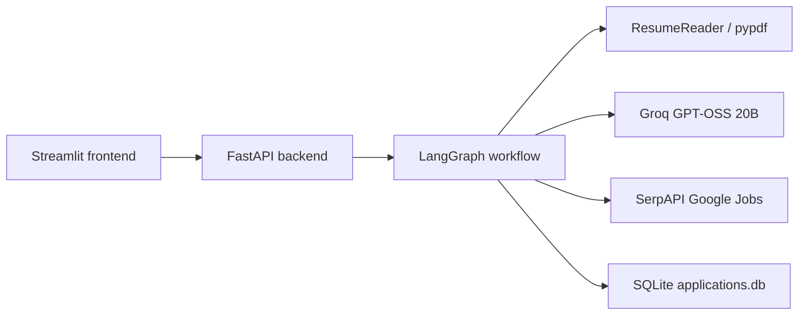

# LangGraph Refactor Study Notes

## Change 1: LangGraph now owns the application flow

### What changed

The FastAPI backend now starts and resumes one LangGraph workflow. The old
endpoints that separately extracted skills, suggested roles, searched jobs,
matched jobs, generated emails, and saved applications were removed.

### Why it was changed

Those endpoints made FastAPI responsible for the order of work. The frontend
had to remember what to call next and pass data between many endpoints. That
made the application flow live outside the graph even though the project had a
LangGraph workflow.

### How it worked before

The frontend called `/upload-resume`, `/extract-skills`, `/suggest-roles`,
`/search-jobs`, `/match-jobs`, `/generate-email`, and `/applications` itself.
Each endpoint ran one tool. FastAPI did not know the full workflow, and the
LangGraph workflow was not used by the running UI.

### How it works now

`POST /workflow/start` creates a graph thread, gives the graph the resume file
path, location, and result limit, and invokes the graph. LangGraph runs nodes
until it reaches an `interrupt`. `POST /workflow/resume` receives the same
thread id and a human answer, then calls `Command(resume=...)`. LangGraph
continues from the node where it paused and chooses the next nodes itself.

### Why LangGraph is better here

A job application is naturally a multi-step process with decisions in the
middle. LangGraph keeps the shared state, the allowed order of nodes, and the
pause/resume behavior in one readable place. FastAPI becomes a thin transport
layer instead of a second workflow engine.

### Files modified

- `backend/main.py`
- `models/schemas.py`
- `workflows/internship_workflow.py`
- `frontend/streamlit_app.py`

## Change 2: The frontend reacts to graph interrupts

### What changed

The Streamlit UI no longer manually chains API calls. It displays the graph
state and renders a form based on the current interrupt type: role selection,
job selection, or email approval.

### Why it was changed

The frontend should display information and collect human input. It should not
decide whether job search comes before matching or email generation.

### How it worked before

Each Streamlit page called a different endpoint and stored intermediate values
such as roles, jobs, and emails in `st.session_state`. The UI therefore owned
the workflow order.

### How it works now

The frontend stores only the graph `thread_id`, returned graph state, and the
current interrupt. When a user makes a decision, it sends that decision to
`/workflow/resume`. It then displays whatever state and next interrupt the
graph returns.

### Why LangGraph is better here

An interrupt is an explicit, visible pause point in the workflow. The UI does
not need custom code for skipping ahead or deciding the next step. It merely
answers the question that the graph asked.

### Files modified

- `frontend/streamlit_app.py`
- `workflows/internship_workflow.py`

## Change 3: Edited emails can be approved through the graph

### What changed

The email-approval interrupt accepts selected job ids together with an edited
email subject and body. The workflow validates that email and passes it to the
existing application storage tool.

### Why it was changed

The previous UI let a user edit an email, but it saved the email through a
separate API endpoint. That bypassed the graph's approval and storage step.

### How it worked before

The frontend generated emails through one endpoint and later called
`/applications` directly to save an edited email.

### How it works now

The frontend includes an edited email in the value used to resume the
`human_approval` node. The graph validates it with the existing `GeneratedEmail`
Pydantic model, then its `application_store` node saves it.

### Why LangGraph is better here

Approval and saving remain connected in the same workflow. It is easy to
explain: no application is stored until the graph receives the user's approval.

### Files modified

- `workflows/internship_workflow.py`
- `frontend/streamlit_app.py`

## Change 4: Job searches now follow result pages

### What changed

The job search tool now follows SerpAPI's `next_page_token` until it reaches
the requested maximum number of unique jobs or SerpAPI has no more pages.

### Why it was changed

The old code read only the first API response. A requested maximum of 10 was
only used as a Python list limit, so it could not retrieve jobs that appeared
on later result pages.

### How it worked before

`JobSearcher.search()` called SerpAPI once and used
`jobs_results[:max_results]`. If the first response contained only one job,
the workflow received one job even when the user selected ten.

### How it works now

The tool reads `serpapi_pagination.next_page_token` from each response and
makes another request with that token. It also skips duplicate job ids. The
search stops as soon as it has enough jobs, the provider gives no next page,
or the provider returns no jobs.

### Why LangGraph is better here

LangGraph does not need to change. Its `job_search` node receives a fuller,
cleaner list from the existing tool and continues to own what happens next.

### Files modified

- `tools/job_search.py`
- `frontend/streamlit_app.py`

## Change 5: Application history can be cleared from the UI

### What changed

The Application History page has a working **Clear history** button. It sends
one `DELETE /applications` request, and the application store deletes all
saved rows from SQLite.

### Why it was changed

History is useful for tracking applications, but a learning project also needs
an easy way to reset demo data. The old screen could display and refresh
history, but it had no backend action to clear it.

### How it works now

The Streamlit button calls the new read/write history endpoint. FastAPI calls
`ApplicationStore.clear_applications()`, which runs one SQL `DELETE` command.
The UI then replaces its cached history with an empty list.

### Why LangGraph is better here

This does not change the workflow. Saving an approved application is still
owned by LangGraph's `application_store` node. Clearing old history is a
separate user-requested maintenance action, so it stays outside the graph.

### Files modified

- `frontend/streamlit_app.py`
- `backend/main.py`
- `tools/application_store.py`
- `.streamlit/config.toml`

## Change 6: A state-driven workflow tracker explains graph progress

### What changed

The main page now shows a horizontal Resume → Skills → Role → Jobs → AI Match
→ Email → Complete tracker directly below the title.

### Why it was changed

The application has several AI and approval stages. A visible tracker helps a
user see that these stages belong to one LangGraph process rather than separate
screens.

### How it works now

`current_workflow_step()` reads the graph state and the current interrupt. For
example, a `role_selection` interrupt highlights Role, a `job_selection`
interrupt highlights AI Match, and a finished storage node highlights Complete.
The tracker never increments a counter when a button is clicked.

### Why LangGraph is better here

LangGraph is the source of truth. The tracker reads the state returned by the
graph, so its progress remains correct even though the frontend reruns after
each Streamlit interaction.

### Files modified

- `frontend/streamlit_app.py`
- `tests/test_workflow_tracker.py`

## Change 7: AI tools use strict JSON schemas

### What changed

Skill extraction, role suggestion, job matching, and email generation now use
Groq's strict JSON-schema mode through chat completions. Each response is then
validated by the same Pydantic model the project already uses.

### Why it was changed

The earlier `responses.parse()` request failed when the model wrote explanatory
text before its JSON answer. The job matcher could not continue because Groq
rejected that non-JSON output.

### How it worked before

Each tool used `responses.parse(..., text_format=Model)`. The prompt asked for
structured output, but the model could still produce prose before the JSON.

### How it works now

Each tool sends `response_format` with its Pydantic-generated JSON schema and
`strict: true`. GPT-OSS 20B is constrained to produce the requested JSON
shape. The Python code reads the JSON response and validates it once more with
Pydantic.

### Why LangGraph is better here

The graph does not need special retry or repair nodes. Each existing AI node
continues to return the same clean tool result, so LangGraph can focus on the
workflow order and human approval pauses.

### Files modified

- `models/schemas.py`
- `tools/skill_extractor.py`
- `tools/job_role_specifier.py`
- `tools/job_matcher.py`
- `tools/email_generator.py`

---

# Final Project Report: Understand the Internship Application Agent from Zero

This is the final reference for the project. Read it in order before an
interview. It explains what happens from the instant a user uploads a resume
until an approved application is stored in the database.

## 0. What problem does the project solve?

Applying to internships involves repeated work: reading a resume, deciding
which roles fit, finding vacancies, comparing each vacancy to the candidate,
writing an email, and tracking applications. This application assists with
those repetitive steps while keeping the user in control of important choices.

It does **not** automatically apply to jobs. It searches, ranks, drafts, and
saves approved applications. The user chooses a role, chooses jobs, reviews the
email, and approves what is saved.

## 1. The big picture



There are four clear responsibilities:

- **Streamlit** displays state and collects decisions from the user.
- **FastAPI** transports requests to and from the workflow.
- **LangGraph** owns the order of actions, state, pauses, and resumes.
- **Tools** perform one focused task: read PDF, call an AI model, search jobs,
  or save data.

This separation is the key idea to explain in an interview. The frontend does
not decide what comes next. LangGraph does.

## 2. Start the application

From the project root, create and activate a virtual environment, install the
dependencies, then provide the two external-service keys:

```bash
python -m venv venv
source venv/bin/activate
pip install -r requirements.txt
```

Create `.env`:

```env
GROQ_API_KEY=your_groq_key
SERPAPI_API_KEY=your_serpapi_key
```

Start the backend in one terminal:

```bash
uvicorn backend.main:app --reload --port 8000
```

Start the UI in a second terminal:

```bash
streamlit run frontend/streamlit_app.py
```

The browser opens Streamlit, usually at `http://localhost:8501`. Streamlit
talks to FastAPI at `http://127.0.0.1:8000` unless `API_BASE_URL` is changed.

## 3. Project folders and why they exist

| Folder/file | Purpose |
|---|---|
| `frontend/streamlit_app.py` | User interface and graph-interrupt forms. |
| `backend/main.py` | Small HTTP layer: start/resume workflow and read/clear history. |
| `workflows/internship_workflow.py` | The central LangGraph state machine. |
| `tools/` | Reusable implementation of the individual capabilities. |
| `prompts/` | AI instructions, separate from Python control flow. |
| `models/schemas.py` | Shared Pydantic data shapes and validation rules. |
| `tests/` | Automated checks using mocks and temporary databases. |
| `.streamlit/config.toml` | Forces the light visual theme. |
| `workflow.png` | Exported visual representation of the graph. |
| `README.md` | Setup and feature overview. |
| `STUDY.md` | Architecture history plus this learning guide. |

The `__init__.py` files mark folders as Python packages. They intentionally
contain no business logic.

## 4. The data schemas: `models/schemas.py`

Pydantic models are typed descriptions of data. They are used to validate API
requests, AI responses, database records, and values passed between modules.
Without them, an LLM or external API could return a missing field or wrong type
and break a later stage unexpectedly.

### Candidate and role schemas

- `ResumeProfile`: `skills`, `experience`, `education`, and `projects` are all
  lists of strings. It is the clean version of a raw resume.
- `JobRoles`: a list of recommended job titles.

Both have `ConfigDict(extra="forbid")`. This means fields not defined by the
model are rejected. That is required by Groq strict JSON schema mode and also
guards against unexpected AI output.

### Job search schemas

- `Job`: the project’s standard job posting shape. It includes identity, title,
  company, location, description, source, link, apply link, posting time,
  employment type, and salary.
- `JobSearchResponse`: wraps a list of `Job` values.

SerpAPI returns provider-specific names such as `company_name`. The job search
tool converts those names into this single `Job` schema. The rest of the
project never needs to know SerpAPI’s raw shape.

### Matching and email schemas

- `MatchEvaluation`: the raw AI judgment: integer `score`, short `reasoning`,
  `strengths`, and `missing_skills`.
- `JobRecommendation`: combines the original `Job` with its evaluation.
- `JobMatchResponse`: wraps the sorted recommendations.
- `GeneratedEmail`: `subject` and `body`.
- `EmailGenerationResponse`: wraps a generated email.

### Application schemas

- `ApplicationCreate`: validated data before a database insert.
- `ApplicationRecord`: persisted application plus `id` and `created_at`.
- `ApplicationStoreResponse` and `ApplicationListResponse`: standard database
  return shapes.

### Request schemas

The old stage-by-stage request models remain useful as documentation of the
tool inputs. The active workflow API uses `WorkflowResumeRequest`, containing:

```json
{
  "thread_id": "the-existing-langgraph-thread-id",
  "resume_value": "the-user-decision"
}
```

`resume_value` is `Any` because it may be a role string, a list of selected job
ids, or a list of approved edited emails. The workflow validates its exact
meaning at the correct pause point.

## 5. Prompts: `prompts/`

Prompts are kept outside the tool code so wording can be improved without
rewriting workflow logic.

- `skill_prompt.py`: asks for only facts in the resume, organized as a profile.
- `job_role_prompt.py`: asks for realistic entry-level roles, not senior roles.
- `job_match_prompt.py`: asks for score, reasoning, strengths, and gaps.
- `email_prompt.py`: asks for a concise email that does not invent credentials
  or claim missing skills.

Prompts influence quality, but Pydantic schemas enforce the output shape.

## 6. Tool modules: the workers of the system

Every tool returns the same simple pattern:

```python
{"success": True, "data": useful_data}
# or
{"success": False, "error": "human-readable message"}
```

This makes it easy for graph nodes to react consistently to errors.

### `tools/resume_reader.py`

`ResumeReader.extract_text(path)` checks file existence and `.pdf` extension,
uses `pypdf.PdfReader`, extracts text from every page, joins pages, cleans tabs
and carriage returns, then returns the text. It is deterministic: no AI is
called here. A limitation is that scanned PDFs without selectable text need OCR,
which this student project does not implement.

### `tools/skill_extractor.py`

This sends raw resume text to Groq’s OpenAI-compatible API. It requests the
strict JSON schema created from `ResumeProfile`, then calls
`ResumeProfile.model_validate_json()` on the reply. The result is a validated
candidate profile.

### `tools/job_role_specifier.py`

This receives the candidate profile, applies the role prompt, requests a strict
`JobRoles` response, validates it, and returns suggested roles.

### `tools/job_search.py`

This calls SerpAPI’s `google_jobs` engine with a role and optional location. It
maps each raw result into a `Job` object. Google Jobs is paginated, so the tool
follows `serpapi_pagination.next_page_token` until it gets the requested maximum
number of unique jobs or the source has no more results. The maximum is a cap,
not a promise: a narrow role/location can legitimately have fewer jobs.

### `tools/job_matcher.py`

For each found job, this tool asks the model to compare the profile with the
job description. It requests strict `MatchEvaluation` JSON, validates it,
combines it with the original `Job` as a `JobRecommendation`, then sorts all
recommendations from highest to lowest score.

One interview trade-off: it performs one AI call per job. This is easy to read
and suitable for a small resume project, but larger systems would consider
batching, concurrency, rate limits, and cost controls.

### `tools/email_generator.py`

This takes one selected job, its match information, and the candidate profile.
It asks the model for a strict `GeneratedEmail` object. The user later sees and
may edit this email before it is saved.

### `tools/application_store.py`

`ApplicationStore` is a small SQLite repository. Its constructor creates the
database/table if it does not already exist. It supports create, get, list,
update status, delete one record, and clear all records.

The database stores the nested job and email as JSON text. On read, the code
uses `json.loads()` and rebuilds Pydantic `Job` and `GeneratedEmail` objects.
This is simple and good for a portfolio project. A production analytics system
would likely normalize searchable fields such as company and job title into
separate columns.

## 7. LangGraph: `workflows/internship_workflow.py`

This is the project’s most important file. A LangGraph graph has:

- **State**: the shared data moving through the graph.
- **Nodes**: functions that do one step and return state updates.
- **Edges**: rules that select the next node.
- **Interrupts**: deliberate pauses for human input.
- **Checkpointer**: storage enabling a paused graph to resume.

### Workflow state

`InternshipWorkflowState` is a `TypedDict` with `total=False`, meaning a node
only needs to return the fields it adds or changes. Important fields appear in
this order:

1. Input: `resume_file_path`, `location`, `max_results`.
2. Resume result: `resume_text`.
3. AI profile: `candidate_profile`.
4. Role stage: `suggested_roles`, then `selected_role`.
5. Search stage: `searched_jobs`, then `matched_jobs`.
6. Selection stage: `selected_matches`.
7. Email stage: `generated_emails`, then `approved_applications`.
8. Persistence stage: `stored_applications`.
9. Failure path: `error`.

### The actual graph path

```text
START
→ resume_reader
→ skill_extractor
→ job_role_specifier
→ human_role_selection (pause)
→ job_search
→ job_matcher
→ human_job_selection (pause)
→ email_generator
→ human_approval (pause)
→ application_store
→ END
```

The `compile()` method creates `StateGraph(InternshipWorkflowState)`, registers
each node, adds the edges, and compiles it with `MemorySaver()`.

`MemorySaver` stores graph checkpoints in memory. It is excellent for this
local learning project. Restarting the FastAPI server clears paused workflow
threads; a production system would use persistent checkpoint storage.

### Error routing

`_route_on_error(next_node)` is used after regular tool nodes. If a node adds an
`error` field, the graph goes directly to `END`; otherwise it visits the next
node. This avoids continuing with partial/bad state.

### Human-in-the-loop pauses

`interrupt(payload)` pauses execution and returns a structured question to the
frontend. The graph pauses at exactly three places:

1. **Role selection**: user provides a role index, role name, or role object.
2. **Job selection**: user provides job indexes or job ids.
3. **Email approval**: user can approve all, approve none, select applications,
   and include an edited subject/body.

`_resolve_role_selection`, `_resolve_job_selection`, and `_resolve_approval`
validate these user answers before the graph uses them. The approval resolver
validates edited emails again with `GeneratedEmail`.

`route_after_job_selection()` ends the graph when no job is selected.
`route_after_approval()` ends it when nothing is approved. This is intentional:
the graph does not create unwanted applications.

## 8. FastAPI: `backend/main.py`

FastAPI is deliberately thin. It does not decide which AI tool runs next.

### `POST /workflow/start`

1. Receives a multipart PDF plus location and maximum results.
2. Writes a temporary copy of the PDF.
3. Creates a UUID `thread_id`.
4. Calls `workflow.invoke(initial_state, config)`.
5. The graph runs until the first interrupt, usually role selection.
6. Returns `thread_id`, current graph `state`, and optional `interrupt`.

The `resume_reader` graph node removes the temporary file after reading it.

### `POST /workflow/resume`

1. Receives a thread id and a human decision.
2. Calls `workflow.invoke(Command(resume=value), same_thread_config)`.
3. LangGraph reloads its checkpoint and continues from the paused interrupt.
4. The backend returns the latest state and next interrupt.

### History endpoints

- `GET /applications`: reads saved SQLite records.
- `DELETE /applications`: clears saved history after the user presses Clear
  History. This is not workflow orchestration; it is a separate maintenance
  action.

## 9. Streamlit UI: `frontend/streamlit_app.py`

Streamlit reruns its script after interactions. `st.session_state` preserves
the small UI state needed between reruns:

- `thread_id`: which LangGraph checkpoint to resume.
- `workflow_state`: the most recent state returned by FastAPI.
- `interrupt`: the question currently asked by the graph.

### Main UI behavior

1. `initialize_state()` initializes those three values only once.
2. `post_start()` sends the PDF to the workflow start endpoint.
3. `resume_workflow()` sends the user’s answer to the workflow resume endpoint.
4. `save_workflow_response()` replaces local state with the graph response.
5. `st.rerun()` redraws the screen with the next graph state.

The UI contains no manual "call job search, then call job matcher" chain.
That order belongs to the graph.

### Dynamic forms

- `render_start_form()` collects resume/location/limit.
- `render_role_selection()` displays roles from the role interrupt.
- `render_job_selection()` displays ranked matches and submits selected ids.
- `render_email_approval()` displays editable emails and sends selected,
  user-edited emails back to the graph.
- `render_history()` automatically loads application records each time the
  History page renders. There is no Refresh button. Clear History is the only
  manual history action.

### Visual tracker

The tracker appears below the title and always remains visible.
`current_workflow_step()` derives its highlighted stage from the returned graph
state and interrupt type. It does not use a manually incremented UI variable.
Completed stages are green, the active stage is blue, and future stages are
gray. This visually demonstrates the structured LangGraph workflow.

## 10. A complete runtime example

Imagine a candidate uploads `resume.pdf`, chooses Remote, and requests 10
results.

1. Streamlit sends the PDF to `/workflow/start`.
2. FastAPI writes a temporary file and starts graph thread `abc`.
3. `resume_reader` extracts PDF text.
4. `skill_extractor` returns a `ResumeProfile`.
5. `job_role_specifier` returns roles such as Backend Engineer Intern.
6. LangGraph pauses with `{type: "role_selection", roles: [...]}`.
7. UI displays the Role tracker state and sends the chosen role to
   `/workflow/resume` with thread `abc`.
8. LangGraph resumes at the paused node, then searches pages of Google Jobs.
9. `job_matcher` evaluates every returned `Job`, sorts recommendations, and
   pauses with `{type: "job_selection", matched_jobs: [...]}`.
10. The user selects jobs. The graph resumes, generates an email for each, and
    pauses at email approval.
11. The user edits/approves emails. The graph resumes, validates the edited
    emails, saves them in SQLite, and reaches `END`.
12. The final response contains `stored_applications`; the tracker shows
    Complete.

## 11. How strict AI output prevents parsing errors

The tools use Groq’s OpenAI-compatible chat completions API with:

```python
response_format={
    "type": "json_schema",
    "json_schema": {
        "name": "job_match_evaluation",
        "strict": True,
        "schema": MatchEvaluation.model_json_schema(),
    },
}
```

The model is constrained to emit valid schema-shaped JSON instead of prose plus
JSON. Python then validates that JSON using `model_validate_json()`. This fixes
the earlier parsing error in which the model wrote reasoning text before the
JSON object.

## 12. Tests: `tests/`

Tests avoid real API calls by mocking OpenAI, SerpAPI, and graph responses.

- `test_resume_reader.py`: manual local PDF check; it should be converted to a
  temporary fixture for fully portable automated testing.
- `test_skill_extractor.py`: strict JSON profile success and AI failure.
- `test_job_specifier.py`: currently a manual script; it could be upgraded to
  a mock-based assertion test.
- `test_job_search.py`: pagination and fewer-results behavior.
- `test_job_matcher.py`: strict match JSON and score handling.
- `test_email_generator.py`: strict email JSON and invalid job handling.
- `test_application_store.py`: creates a temporary SQLite database and checks
  create/get/list/update/delete/clear behavior.
- `test_backend_api.py`: tests workflow start, workflow resume, and history
  endpoints with mocked dependencies.
- `test_internship_workflow.py`: checks interrupts, resume commands, error
  stopping, graph connections, saving, and email edits.
- `test_workflow_tracker.py`: checks state-to-tracker mapping.

Run the maintained suite with:

```bash
venv/bin/python -m unittest \
  tests.test_skill_extractor tests.test_job_search tests.test_job_matcher \
  tests.test_email_generator tests.test_application_store tests.test_backend_api \
  tests.test_internship_workflow tests.test_workflow_tracker
```

## 13. Honest limitations and sensible next improvements

This is intentionally a resume project, so simple choices are appropriate.

- `MemorySaver` loses paused workflows when the backend restarts.
- Scanned PDFs need OCR support.
- Search results depend on SerpAPI/Google availability and the narrowness of
  the selected role/location.
- Matching makes one AI request per job, which can be slow/costly for many
  results.
- SQLite JSON fields are simple but not optimized for complex analytics.
- There is no login/authentication, email delivery, or automatic application
  submission.

Do not call these flaws without context in an interview. Say they are conscious
portfolio-project trade-offs and explain the next production improvement.

## 14. Interview-ready answer

> “I built an AI-assisted internship application workflow using Streamlit,
> FastAPI, LangGraph, Groq, SerpAPI, Pydantic, and SQLite. Streamlit only
> renders workflow state and collects decisions. FastAPI only starts or resumes
> the graph. LangGraph owns the state and sequence: it reads a resume, extracts
> a profile, suggests roles, searches and ranks jobs, generates emails, pauses
> for human approval with interrupts, and stores approved applications. Pydantic
> validates every important boundary, including strict structured AI output.
> This makes the process explainable, human-controlled, and easy to extend.”

## 15. Recommended reading order before an interview

1. Read this report once from start to finish.
2. Read `models/schemas.py` to understand the data.
3. Read `tools/` to understand individual capabilities.
4. Read `workflows/internship_workflow.py` to understand orchestration.
5. Read `backend/main.py` to understand start/resume transport.
6. Read `frontend/streamlit_app.py` to understand display and user input.
7. Run the tests and explain one test from each layer.
